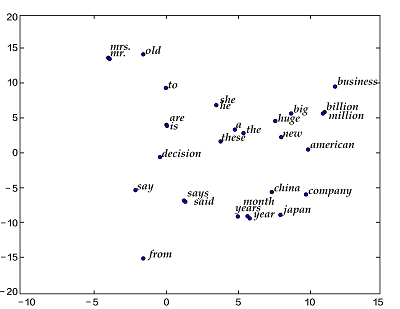
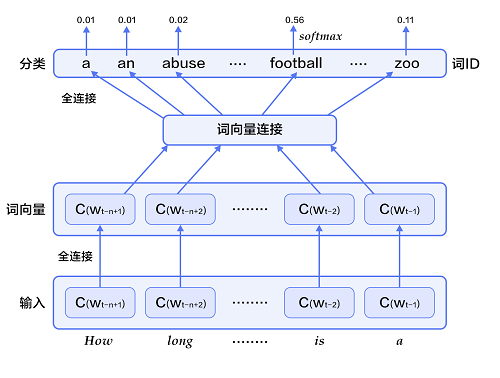
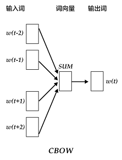
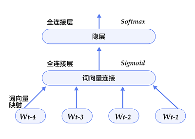

# 词向量

本教程源代码目录在[book/word2vec](https://github.com/PaddlePaddle/book/tree/develop/04.word2vec)， 初次使用请参考PaddlePaddle[安装教程](https://github.com/PaddlePaddle/book/blob/develop/README.cn.md#运行这本书)。

## 背景介绍

本章我们介绍词的向量表征，也称为word embedding。词向量是自然语言处理中常见的一个操作，是搜索引擎、广告系统、推荐系统等互联网服务背后常见的基础技术。

在这些互联网服务里，我们经常要比较两个词或者两段文本之间的相关性。为了做这样的比较，我们往往先要把词表示成计算机适合处理的方式。最自然的方式恐怕莫过于向量空间模型(vector space model)。
在这种方式里，每个词被表示成一个实数向量（one-hot vector），其长度为字典大小，每个维度对应一个字典里的每个词，除了这个词对应维度上的值是1，其他元素都是0。

One-hot vector虽然自然，但是用处有限。比如，在互联网广告系统里，如果用户输入的query是“母亲节”，而有一个广告的关键词是“康乃馨”。虽然按照常理，我们知道这两个词之间是有联系的——母亲节通常应该送给母亲一束康乃馨；但是这两个词对应的one-hot vectors之间的距离度量，无论是欧氏距离还是余弦相似度(cosine similarity)，由于其向量正交，都认为这两个词毫无相关性。 得出这种与我们相悖的结论的根本原因是：每个词本身的信息量都太小。所以，仅仅给定两个词，不足以让我们准确判别它们是否相关。要想精确计算相关性，我们还需要更多的信息——从大量数据里通过机器学习方法归纳出来的知识。

在机器学习领域里，各种“知识”被各种模型表示，词向量模型(word embedding model)就是其中的一类。通过词向量模型可将一个 one-hot vector映射到一个维度更低的实数向量（embedding vector），如$embedding(母亲节) = [0.3, 4.2, -1.5, ...], embedding(康乃馨) = [0.2, 5.6, -2.3, ...]$。在这个映射到的实数向量表示中，希望两个语义（或用法）上相似的词对应的词向量“更像”，这样如“母亲节”和“康乃馨”的对应词向量的余弦相似度就不再为零了。

词向量模型可以是概率模型、共生矩阵(co-occurrence matrix)模型或神经元网络模型。在用神经网络求词向量之前，传统做法是统计一个词语的共生矩阵$X$。$X$是一个$|V| \times |V|$ 大小的矩阵，$X_{ij}$表示在所有语料中，词汇表`V`(vocabulary)中第i个词和第j个词同时出现的词数，$|V|$为词汇表的大小。对$X$做矩阵分解（如奇异值分解，Singular Value Decomposition \[[5](#参考文献)\]），得到的$U$即视为所有词的词向量：

$$X = USV^T$$

但这样的传统做法有很多问题：<br/>
1) 由于很多词没有出现，导致矩阵极其稀疏，因此需要对词频做额外处理来达到好的矩阵分解效果；<br/>
2) 矩阵非常大，维度太高(通常达到$10^6*10^6$的数量级)；<br/>
3) 需要手动去掉停用词（如although, a,...），不然这些频繁出现的词也会影响矩阵分解的效果。


基于神经网络的模型不需要计算存储一个在全语料上统计的大表，而是通过学习语义信息得到词向量，因此能很好地解决以上问题。在本章里，我们将展示基于神经网络训练词向量的细节，以及如何用PaddlePaddle训练一个词向量模型。


## 效果展示

本章中，当词向量训练好后，我们可以用数据可视化算法t-SNE\[[4](#参考文献)\]画出词语特征在二维上的投影（如下图所示）。从图中可以看出，语义相关的词语（如a, the, these; big, huge）在投影上距离很近，语意无关的词（如say, business; decision, japan）在投影上的距离很远。

  
图1. 词向量的二维投影

另一方面，我们知道两个向量的余弦值在$[-1,1]$的区间内：两个完全相同的向量余弦值为1, 两个相互垂直的向量之间余弦值为0，两个方向完全相反的向量余弦值为-1，即相关性和余弦值大小成正比。因此我们还可以计算两个词向量的余弦相似度:

```
similarity: 0.899180685161
please input two words: big huge

please input two words: from company
similarity: -0.0997506977351
```

以上结果可以通过运行`calculate_dis.py`, 加载字典里的单词和对应训练特征结果得到，我们将在[应用模型](#应用模型)中详细描述用法。


## 模型概览

在这里我们介绍三个训练词向量的模型：N-gram模型，CBOW模型和Skip-gram模型，它们的中心思想都是通过上下文得到一个词出现的概率。对于N-gram模型，我们会先介绍语言模型的概念，并在之后的[训练模型](#训练模型)中，带大家用PaddlePaddle实现它。而后两个模型，是近年来最有名的神经元词向量模型，由 Tomas Mikolov 在Google 研发\[[3](#参考文献)\]，虽然它们很浅很简单，但训练效果很好。

### 语言模型

在介绍词向量模型之前，我们先来引入一个概念：语言模型。
语言模型旨在为语句的联合概率函数$P(w_1, ..., w_T)$建模, 其中$w_i$表示句子中的第i个词。语言模型的目标是，希望模型对有意义的句子赋予大概率，对没意义的句子赋予小概率。
这样的模型可以应用于很多领域，如机器翻译、语音识别、信息检索、词性标注、手写识别等，它们都希望能得到一个连续序列的概率。 以信息检索为例，当你在搜索“how long is a football bame”时（bame是一个医学名词），搜索引擎会提示你是否希望搜索"how long is a football game", 这是因为根据语言模型计算出“how long is a football bame”的概率很低，而与bame近似的，可能引起错误的词中，game会使该句生成的概率最大。

对语言模型的目标概率$P(w_1, ..., w_T)$，如果假设文本中每个词都是相互独立的，则整句话的联合概率可以表示为其中所有词语条件概率的乘积，即：

$$P(w_1, ..., w_T) = \prod_{t=1}^TP(w_t)$$

然而我们知道语句中的每个词出现的概率都与其前面的词紧密相关, 所以实际上通常用条件概率表示语言模型：

$$P(w_1, ..., w_T) = \prod_{t=1}^TP(w_t | w_1, ... , w_{t-1})$$


### N-gram neural model

在计算语言学中，n-gram是一种重要的文本表示方法，表示一个文本中连续的n个项。基于具体的应用场景，每一项可以是一个字母、单词或者音节。 n-gram模型也是统计语言模型中的一种重要方法，用n-gram训练语言模型时，一般用每个n-gram的历史n-1个词语组成的内容来预测第n个词。

Yoshua Bengio等科学家就于2003年在著名论文 Neural Probabilistic Language Models \[[1](#参考文献)\] 中介绍如何学习一个神经元网络表示的词向量模型。文中的神经概率语言模型（Neural Network Language Model，NNLM）通过一个线性映射和一个非线性隐层连接，同时学习了语言模型和词向量，即通过学习大量语料得到词语的向量表达，通过这些向量得到整个句子的概率。用这种方法学习语言模型可以克服维度灾难（curse of dimensionality）,即训练和测试数据不同导致的模型不准。注意：由于“神经概率语言模型”说法较为泛泛，我们在这里不用其NNLM的本名，考虑到其具体做法，本文中称该模型为N-gram neural model。

我们在上文中已经讲到用条件概率建模语言模型，即一句话中第$t$个词的概率和该句话的前$t-1$个词相关。可实际上越远的词语其实对该词的影响越小，那么如果考虑一个n-gram, 每个词都只受其前面`n-1`个词的影响，则有：

$$P(w_1, ..., w_T) = \prod_{t=n}^TP(w_t|w_{t-1}, w_{t-2}, ..., w_{t-n+1})$$

给定一些真实语料，这些语料中都是有意义的句子，N-gram模型的优化目标则是最大化目标函数:

$$\frac{1}{T}\sum_t f(w_t, w_{t-1}, ..., w_{t-n+1};\theta) + R(\theta)$$

其中$f(w_t, w_{t-1}, ..., w_{t-n+1})$表示根据历史n-1个词得到当前词$w_t$的条件概率，$R(\theta)$表示参数正则项。

  
图2. N-gram神经网络模型

图2展示了N-gram神经网络模型，从下往上看，该模型分为以下几个部分：
&emsp;&emsp;对于每个样本，模型输入$w_{t-n+1},...w_{t-1}$, 输出句子第t个词为字典中`|V|`个词的概率。  

&emsp;&emsp;每个输入词$w_{t-n+1},...w_{t-1}$首先通过映射矩阵映射到词向量$C(w_{t-n+1}),...C(w_{t-1})$。  

&emsp;&emsp;然后所有词语的词向量连接成一个大向量，并经过一个非线性映射得到历史词语的隐层表示：  

    $$g=Utanh(\theta^Tx + b_1) + Wx + b_2$$

    其中，$x$为所有词语的词向量连接成的大向量，表示文本历史特征；$\theta$、$U$、$b_1$、$b_2$和$W$分别为词向量层到隐层连接的参数。$g$表示未经归一化的所有输出单词概率，$g_i$表示未经归一化的字典中第$i$个单词的输出概率。

&emsp;&emsp;根据softmax的定义，通过归一化$g_i$, 生成目标词$w_t$的概率为：  

  $$P(w_t | w_1, ..., w_{t-n+1}) = \frac{e^{g_{w_t}}}{\sum_i^{|V|} e^{g_i}}$$

&emsp;&emsp;整个网络的损失值(cost)为多类分类交叉熵，用公式表示为  

   $$J(\theta) = -\sum_{i=1}^N\sum_{c=1}^{|V|}y_k^{i}log(softmax(g_k^i))$$

&emsp;&emsp;其中$y_k^i$表示第$i$个样本第$k$类的真实标签(0或1)，$softmax(g_k^i)$表示第i个样本第k类softmax输出的概率。  


### Continuous Bag-of-Words model(CBOW)

CBOW模型通过一个词的上下文（各N个词）预测当前词。当N=2时，模型如下图所示：

  
图3. CBOW模型

具体来说，不考虑上下文的词语输入顺序，CBOW是用上下文词语的词向量的均值来预测当前词。即：

$$context = \frac{x_{t-1} + x_{t-2} + x_{t+1} + x_{t+2}}{4}$$

其中$x_t$为第$t$个词的词向量，分类分数（score）向量 $z=U*context$，最终的分类$y$采用softmax，损失函数采用多类分类交叉熵。

### Skip-gram model

CBOW的好处是对上下文词语的分布在词向量上进行了平滑，去掉了噪声，因此在小数据集上很有效。而Skip-gram的方法中，用一个词预测其上下文，得到了当前词上下文的很多样本，因此可用于更大的数据集。

  
图4. Skip-gram模型

如上图所示，Skip-gram模型的具体做法是，将一个词的词向量映射到$2n$个词的词向量（$2n$表示当前输入词的前后各$n$个词），然后分别通过softmax得到这$2n$个词的分类损失值之和。


## 数据准备

### 数据介绍

本教程使用Penn Treebank （PTB）（经Tomas Mikolov预处理过的版本）数据集。PTB数据集较小，训练速度快，应用于Mikolov的公开语言模型训练工具\[[2](#参考文献)\]中。其统计情况如下：

<p align="center">
<table>
    <tr>
        <td>训练数据</td>
        <td>验证数据</td>
        <td>测试数据</td>
    </tr>
    <tr>
        <td>ptb.train.txt</td>
        <td>ptb.valid.txt</td>
        <td>ptb.test.txt</td>
    </tr>
    <tr>
        <td>42068句</td>
        <td>3370句</td>
        <td>3761句</td>
    </tr>
</table>
</p>


### 数据预处理

本章训练的是5-gram模型，表示在PaddlePaddle训练时，每条数据的前4个词用来预测第5个词。PaddlePaddle提供了对应PTB数据集的python包`paddle.dataset.imikolov`，自动做数据的下载与预处理，方便大家使用。

预处理会把数据集中的每一句话前后加上开始符号`<s>`以及结束符号`<e>`。然后依据窗口大小（本教程中为5），从头到尾每次向右滑动窗口并生成一条数据。

如"I have a dream that one day" 一句提供了5条数据：

```text
<s> I have a dream
I have a dream that
have a dream that one
a dream that one day
dream that one day <e>
```

最后，每个输入会按其单词次在字典里的位置，转化成整数的索引序列，作为PaddlePaddle的输入。
## 编程实现

本配置的模型结构如下图所示：

    
图5. 模型配置中的N-gram神经网络模型

首先，加载所需要的包：

```python
import math
import paddle.v2 as paddle
```

然后，定义参数：
```python
embsize = 32 # 词向量维度
hiddensize = 256 # 隐层维度
N = 5 # 训练5-Gram
```

接着，定义网络结构：

&emsp;&emsp;将$w_t$之前的$n-1$个词 $w_{t-n+1},...w_{t-1}$，通过$|V|\times D$的矩阵映射到D维词向量（本例中取D=32）。  

```python
def wordemb(inlayer):
    wordemb = paddle.layer.table_projection(
        input=inlayer,
        size=embsize,
        param_attr=paddle.attr.Param(
            name="_proj",
            initial_std=0.001,
            learning_rate=1,
            l2_rate=0,
            sparse_update=True))
    return wordemb
```

&emsp;&emsp;定义输入层接受的数据类型以及名字。  

```python
paddle.init(use_gpu=False, trainer_count=3) # 初始化PaddlePaddle
word_dict = paddle.dataset.imikolov.build_dict()
dict_size = len(word_dict)
# 每个输入层都接受整形数据，这些数据的范围是[0, dict_size)
firstword = paddle.layer.data(
    name="firstw", type=paddle.data_type.integer_value(dict_size))
secondword = paddle.layer.data(
    name="secondw", type=paddle.data_type.integer_value(dict_size))
thirdword = paddle.layer.data(
    name="thirdw", type=paddle.data_type.integer_value(dict_size))
fourthword = paddle.layer.data(
    name="fourthw", type=paddle.data_type.integer_value(dict_size))
nextword = paddle.layer.data(
    name="fifthw", type=paddle.data_type.integer_value(dict_size))

Efirst = wordemb(firstword)
Esecond = wordemb(secondword)
Ethird = wordemb(thirdword)
Efourth = wordemb(fourthword)
```

&emsp;&emsp;将这n-1个词向量经过concat_layer连接成一个大向量作为历史文本特征。  

```python
contextemb = paddle.layer.concat(input=[Efirst, Esecond, Ethird, Efourth])
```

&emsp;&emsp;将历史文本特征经过一个全连接得到文本隐层特征。  

```python
hidden1 = paddle.layer.fc(input=contextemb,
                          size=hiddensize,
                          act=paddle.activation.Sigmoid(),
                          layer_attr=paddle.attr.Extra(drop_rate=0.5),
                          bias_attr=paddle.attr.Param(learning_rate=2),
                          param_attr=paddle.attr.Param(
                                initial_std=1. / math.sqrt(embsize * 8),
                                learning_rate=1))
```

&emsp;&emsp;将文本隐层特征，再经过一个全连接，映射成一个$|V|$维向量，同时通过softmax归一化得到这`|V|`个词的生成概率。

```python
predictword = paddle.layer.fc(input=hidden1,
                              size=dict_size,
                              bias_attr=paddle.attr.Param(learning_rate=2),
                              act=paddle.activation.Softmax())
```

&emsp;&emsp;网络的损失函数为多分类交叉熵，可直接调用`classification_cost`函数。  

```python
cost = paddle.layer.classification_cost(input=predictword, label=nextword)
```

然后，指定训练相关的参数：

&emsp;&emsp;训练方法（optimizer)： 代表训练过程在更新权重时采用动量优化器，本教程使用Adam优化器。  
&emsp;&emsp;训练速度（learning_rate）： 迭代的速度，与网络的训练收敛速度有关系。  
&emsp;&emsp;正则化（regularization）： 是防止网络过拟合的一种手段，此处采用L2正则化。  

```python
parameters = paddle.parameters.create(cost)
adagrad = paddle.optimizer.AdaGrad(
    learning_rate=3e-3,
    regularization=paddle.optimizer.L2Regularization(8e-4))
trainer = paddle.trainer.SGD(cost, parameters, adagrad)
```

下一步，我们开始训练过程。`paddle.dataset.imikolov.train()`和`paddle.dataset.imikolov.test()`分别做训练和测试数据集。这两个函数各自返回一个reader——PaddlePaddle中的reader是一个Python函数，每次调用的时候返回一个Python generator。

`paddle.batch`的输入是一个reader，输出是一个batched reader —— 在PaddlePaddle里，一个reader每次yield一条训练数据，而一个batched reader每次yield一个minbatch。

```python
import gzip

def event_handler(event):
    if isinstance(event, paddle.event.EndIteration):
        if event.batch_id % 100 == 0:
            print "Pass %d, Batch %d, Cost %f, %s" % (
                event.pass_id, event.batch_id, event.cost, event.metrics)

    if isinstance(event, paddle.event.EndPass):
        result = trainer.test(
                    paddle.batch(
                        paddle.dataset.imikolov.test(word_dict, N), 32))
        print "Pass %d, Testing metrics %s" % (event.pass_id, result.metrics)
        with gzip.open("model_%d.tar.gz"%event.pass_id, 'w') as f:
            parameters.to_tar(f)

trainer.train(
    paddle.batch(paddle.dataset.imikolov.train(word_dict, N), 32),
    num_passes=100,
    event_handler=event_handler)
```

```text
Pass 0, Batch 0, Cost 7.870579, {'classification_error_evaluator': 1.0}, Testing metrics {'classification_error_evaluator': 0.999591588973999}
Pass 0, Batch 100, Cost 6.136420, {'classification_error_evaluator': 0.84375}, Testing metrics {'classification_error_evaluator': 0.8328699469566345}
Pass 0, Batch 200, Cost 5.786797, {'classification_error_evaluator': 0.8125}, Testing metrics {'classification_error_evaluator': 0.8328542709350586}
...
```

训练过程是完全自动的，event_handler里打印的日志类似如上所示：

经过30个pass，我们将得到平均错误率为classification_error_evaluator=0.735611。


## 应用模型
训练模型后，我们可以加载模型参数，用训练出来的词向量初始化其他模型，也可以将模型查看参数用来做后续应用。


### 查看词向量

PaddlePaddle训练出来的参数可以直接使用`parameters.get()`获取出来。例如查看单词`apple`的词向量，即为


```python
embeddings = parameters.get("_proj").reshape(len(word_dict), embsize)

print embeddings[word_dict['apple']]
```

```text
[-0.38961065 -0.02392169 -0.00093231  0.36301503  0.13538605  0.16076435
-0.0678709   0.1090285   0.42014077 -0.24119169 -0.31847557  0.20410083
0.04910378  0.19021918 -0.0122014  -0.04099389 -0.16924137  0.1911236
-0.10917275  0.13068172 -0.23079982  0.42699069 -0.27679482 -0.01472992
0.2069038   0.09005053 -0.3282454   0.12717034 -0.24218646  0.25304323
0.19072419 -0.24286366]
```


### 修改词向量

获得到的embedding为一个标准的numpy矩阵。我们可以对这个numpy矩阵进行修改，然后赋值回去。


```python
def modify_embedding(emb):
    # Add your modification here.
    pass

modify_embedding(embeddings)
parameters.set("_proj", embeddings)
```

### 计算词语之间的余弦距离

两个向量之间的距离可以用余弦值来表示，余弦值在$[-1,1]$的区间内，向量间余弦值越大，其距离越近。这里我们在`calculate_dis.py`中实现不同词语的距离度量。
用法如下：


```python
from scipy import spatial

emb_1 = embeddings[word_dict['world']]
emb_2 = embeddings[word_dict['would']]

print spatial.distance.cosine(emb_1, emb_2)
```

```text
0.99375076448
```

## 总结
本章中，我们介绍了词向量、语言模型和词向量的关系、以及如何通过训练神经网络模型获得词向量。在信息检索中，我们可以根据向量间的余弦夹角，来判断query和文档关键词这二者间的相关性。在句法分析和语义分析中，训练好的词向量可以用来初始化模型，以得到更好的效果。在文档分类中，有了词向量之后，可以用聚类的方法将文档中同义词进行分组。希望大家在本章后能够自行运用词向量进行相关领域的研究。


## 参考文献
1. Bengio Y, Ducharme R, Vincent P, et al. [A neural probabilistic language model](http://www.jmlr.org/papers/volume3/bengio03a/bengio03a.pdf)[J]. journal of machine learning research, 2003, 3(Feb): 1137-1155.
2. Mikolov T, Kombrink S, Deoras A, et al. [Rnnlm-recurrent neural network language modeling toolkit](http://www.fit.vutbr.cz/~imikolov/rnnlm/rnnlm-demo.pdf)[C]//Proc. of the 2011 ASRU Workshop. 2011: 196-201.
3. Mikolov T, Chen K, Corrado G, et al. [Efficient estimation of word representations in vector space](https://arxiv.org/pdf/1301.3781.pdf)[J]. arXiv preprint arXiv:1301.3781, 2013.
4. Maaten L, Hinton G. [Visualizing data using t-SNE](https://lvdmaaten.github.io/publications/papers/JMLR_2008.pdf)[J]. Journal of Machine Learning Research, 2008, 9(Nov): 2579-2605.
5. https://en.wikipedia.org/wiki/Singular_value_decomposition

<br/>
<a rel="license" href="http://creativecommons.org/licenses/by-sa/4.0/"></a><br /><span xmlns:dct="http://purl.org/dc/terms/" href="http://purl.org/dc/dcmitype/Text" property="dct:title" rel="dct:type">本教程</span> 由 <a xmlns:cc="http://creativecommons.org/ns#" href="http://book.paddlepaddle.org" property="cc:attributionName" rel="cc:attributionURL">PaddlePaddle</a> 创作，采用 <a rel="license" href="http://creativecommons.org/licenses/by-sa/4.0/">知识共享 署名-相同方式共享 4.0 国际 许可协议</a>进行许可。
